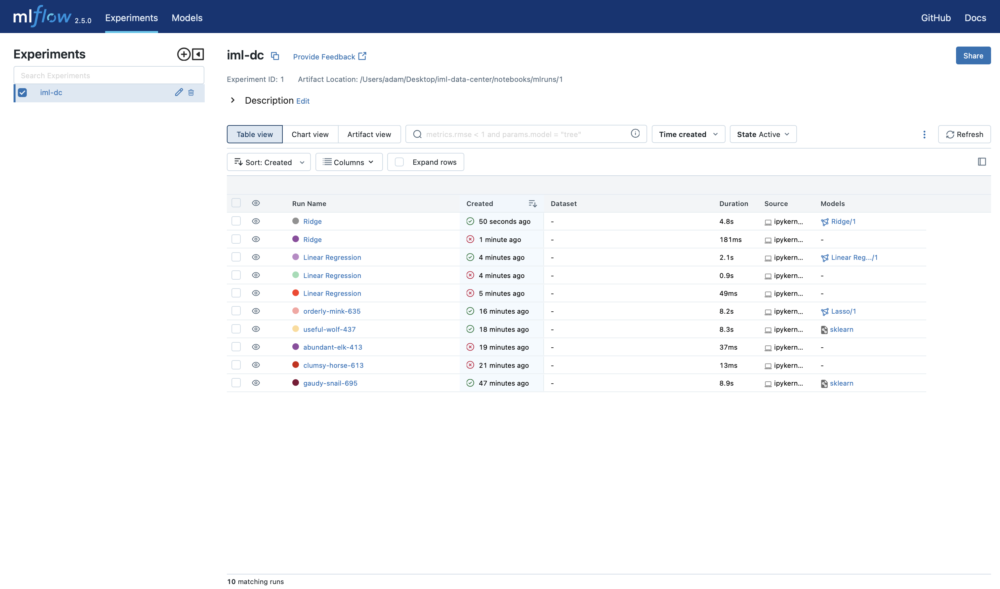
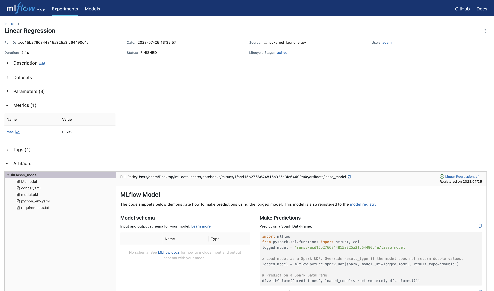
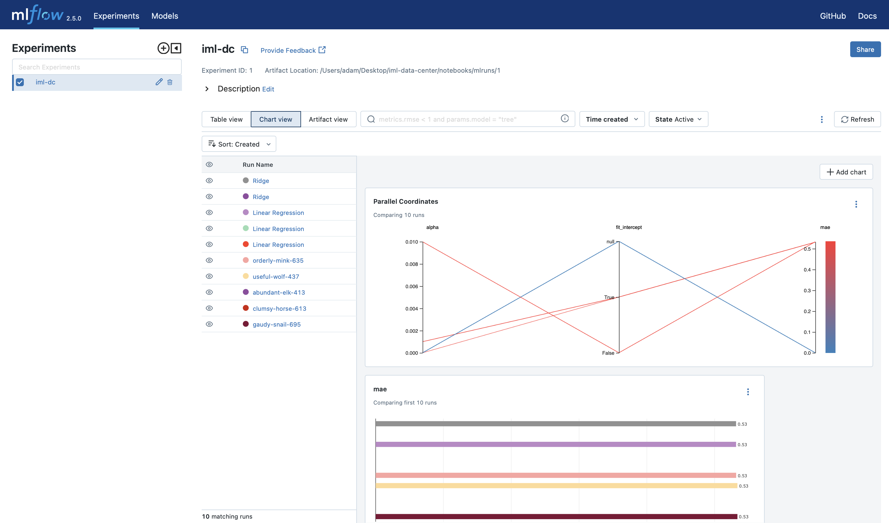
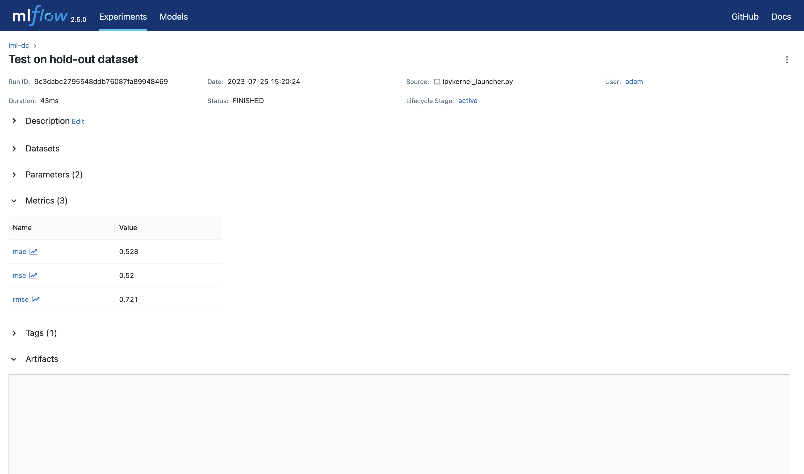

  

# Industrial Machine Learning: Data Center Air Cooling
This project is a part of the Industrial Machine Learning course at Harbour.Space.  

## Project Description
The main goal of this project is to optimize energy consumption and cooling efficiency in a data center. It aims to reduce overall energy usage while ensuring effective cooling for the data center's equipment, thereby lowering operational costs associated with data processing and storage operations.

We will construct a predictive model that considers various factors such as server utilization, workload distribution, cooling efficiency, and energy management systems. By analyzing these parameters, the model will generate energy consumption forecasts for the data center.

Data Source Link: [Data Source](https://ieee-dataport.org/open-access/data-server-energy-consumption-dataset)

**Model Validation**:
To validate the predictive model, we will compare its energy consumption forecasts with actual energy usage data from the data center. By evaluating the model's accuracy and effectiveness in optimizing energy consumption, we can determine its practical applicability.

**Modeling Technique**:
Given the temporal nature of energy consumption patterns, we will utilize Time Series analysis to develop the predictive model. Time Series models are well-suited for forecasting future values based on past data, making them appropriate for predicting energy consumption in a data center, especially during peak loads when cooling requirements are higher.

## Project Tasks
 

✅ Take the dataset you selected for the final project.  
✅ Run experiments to find optimal hyperparameters and feature engineering for your model. While running experiments, use the cross-validation technique for quality estimation and Mlflow tracking.  
✅ Select the best model, load it back to Jupyter/script, and estimate the quality on a hold-out dataset.
- Write a conclusion about the experiment results.  
  
As a result, I expect to receive a link to a GitHub/Gitlab repository, which consists of the following:  
- a well-written read.me, which explains what is stored in this repo and how to reproduce experiments  
✅ script or scripts with experiments and experiment tracking  
✅ any supporting materials like visualization results, scripts, instructions, or links that help understand your case and experiment results better.  

## Dataset Description
This dataset comprises sensor readings obtained from an HP Z440 workstation during a 245-day (35-week) period, with data sampled at a rate of one value per second. The dataset encompasses diverse variables that pertain to the workstation's functioning, power usage, and temperature.

The columns in the dataset correspond to the following variables:

1. Voltage (V)
2. Current (A)
3. Power (W) - measured in Watts (W)
4. Frequency (Hz) - measured in Hertz (Hz)
5. Active Energy - measured in kilowatts per hour (KWh)
6. Power Factor - a dimensionless quantity
7. ESP32 Temperature - measured in Centigrade Degrees (°C)
8. CPU Consumption - measured as a percentage (%)
9. CPU Power Consumption - measured as a percentage (%)
10. CPU Temperature - measured in Centigrade Degrees (°C)
11. GPU Consumption - measured as a percentage (%)
12. GPU Power Consumption - measured as a percentage (%)
13. GPU Temperature - measured in Centigrade Degrees (°C)
14. RAM Memory Consumption - measured as a percentage (%)
15. RAM Memory Power Consumption - measured as a percentage (%)

The dataset was collected from an air free-cooled data center testbed, and it includes measurements from instrumented hardware and software sensors during tests on the testbed. 

Each data point in the dataset is indexed by a timestamp indicating when the sensor measurement was taken.

**Example:**

| Timestamp                | Voltage | Current | Power | Frequency | Active Energy | Power Factor | ESP32 Temp (°C) | CPU (%) | CPU Power (%) | CPU Temp (°C) | GPU (%) | GPU Power (%) | GPU Temp (°C) | RAM (%) | RAM Power (%) |
|--------------------------|---------|---------|-------|-----------|---------------|--------------|-----------------|---------|---------------|---------------|---------|---------------|---------------|---------|---------------|
| 2023-01-01 00:00:00 UTC  | 220     | 1.5     | 330   | 50        | 12.5          | 0.95         | 25              | 60      | 50            | 40            | 70      | 60            | 50            | 80      | 70            |
| 2023-01-01 00:00:01 UTC  | 221     | 1.6     | 355   | 50        | 12.8          | 0.96         | 26              | 58      | 49            | 39            | 71      | 62            | 52            | 81      | 71            |
| ...                      | ...     | ...     | ...   | ...       | ...           | ...          | ...             | ...     | ...           | ...           | ...     | ...           | ...           | ...     | ...           |

## Directory layout

    .
    ├── data                             # Main data directory
    ├── ml_flow.db                       # MLflow database
    ├── notebooks                        # Jupyter notebooks
    │   ├── mlruns                       # MLflow directory for storing artifacts
    │   ├── IML_New_Preparation.ipynb    # EDA notebook
    │   ├── IML_mlflow.ipynb             # Training MLflow notebook (if needed can be converted to just .py)
    │   ├── IML_Test.ipynb               # MLflow notebook that loads the best model from experiments and evalutes it on the test set
    │   └── IML_Preparation.ipynb        # Old EDA notebook
    ├── images                           # Directory for pictures and graphs
    ├── reports                          # HTML reports. Can be viewed via Github Pages
    ├── ...
    ├── .github/workflows                # Github workflow directory
    ├── .gitignore                       # 
    ├── .git                             #
    └── README.md

## Directory layout of saved MLflow models

    my_model/
    ├── MLmodel
    ├── model.pkl
    ├── conda.yaml
    ├── python_env.yaml
    └── requirements.txt

## View reports
[Dataset profiling](https://adamxrvn.github.io/iml-data-center/reports/report.html) (Before preprocessing)  
[Dataset profiling](https://adamxrvn.github.io/iml-data-center/reports/report_eda.html) (After preprocessing)  
[Dataset profiling](https://adamxrvn.github.io/iml-data-center/reports/report_resampling.html) (After resampling)  

## Project Results

In this project, our initial approach was to work with a rich dataset containing 327 files. However, during the analysis phase, we encountered numerous gaps and inconsistencies within the data. The dataset was structured horizontally and vertically based on experiments and sensor outputs, which made merging the data problematic and resulted in the presence of NaNs. Additionally, the lack of synchronization in data collection further complicated matters, as the sensors saved results at slightly different times, and the ranges within which the results were taken varied.

As a solution, we turned to another dataset mentioned in the preproject study, which proved to be relatively more consistent. We proceeded to build a regression model for energy consumption, employing linear regression, ridge regression, and lasso regression. During feature selection, we identified and removed several highly-correlated features, and all the values were appropriately scaled.

Upon testing the models using a dedicated test set, all three models exhibited similar results, with a mean absolute error (MAE) of approximately 0.532. Furthermore, on an external test dataset, we observed an MAE of 0.52. This slight discrepancy can be attributed to the scaling of values.

Throughout the project, we utilized MLflow tracking to keep records of experiments and models, providing better insights into the performance of various configurations. Additionally, we incorporated yHat profiling with GitHub Actions to make profiling results accessible through [Github Pages](https://adamxrvn.github.io/iml-data-center/reports/report.html).

Moving forward, we plan to explore further fine-tuning of the models. If deemed necessary, we will delve into Time Series analysis modeling, acknowledging that this approach may require a significant investment of time and resources.

## Getting Started
To reproduce the results:

1. Clone this repo 
2. Go to the repository's folder
3. Run the MLflow server: `mlflow ui --backend-store-uri sqlite:///ml_flow.db --default-artifact-root ./mlruns`
4. Run `IML_mlflow` to transform the data and start training
5. Open MLflow's dashoard to view the results 
6. Run `IML_Test` to assess the model on the test dataset 